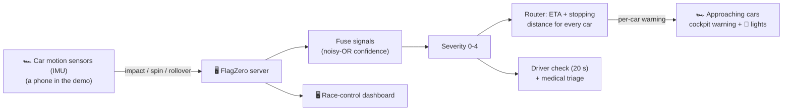

# FlagZero 🏁

**The driver most at risk isn't the one who crashed; it's the one who hasn't arrived yet.**

When a car crashes, FlagZero reads the crash from the car's own motion sensors, fuses every signal
about it, decides how serious it is, works out **which cars are coming and how many seconds away
they are**, and warns each of them in the cockpit **before they arrive**. Today that job depends on
marshals seeing the crash and waving a flag.

### At a glance
- **What:** each car's motion sensors (IMU) detect a crash; one server predicts which cars are
  approaching and how many seconds away they are, and warns each of them before it arrives.
- **Speed:** in 10,000 simulated incidents, drivers were warned in **0.35 s** (median) instead of
  **4.6 s** with marshals alone. Warning latency is also measured live on the demo phones.
- **Result (simulation):** **94.9 %** of approaching cars warned in time vs **48.4 %** with
  marshals, and **50 % fewer** secondary impacts.
- **Demo hardware:** two phones play the cars (their accelerometer and gyro are the IMU) and an
  Arduino is the in-car warning light. A real car would use the sensors and cockpit lights it already has.
- **Honest:** it's a prototype measured in simulation; see [Honest limits](#10-honest-limits).

---

## Contents
1. [The problem](#1-the-problem)
2. [What FlagZero does](#2-what-flagzero-does)
3. [The demo](#3-the-demo)
4. [The in-car warning lights](#4-the-in-car-warning-lights)
5. [How it decides: flags, severity and ETA](#5-how-it-decides-flags-severity-and-eta)
6. [The proof: Monte Carlo and per-incident replay](#6-the-proof-monte-carlo-and-per-incident-replay)
7. [Quick start](#7-quick-start)
8. [Repository layout](#8-repository-layout)
9. [Tests](#9-tests)
10. [Honest limits](#10-honest-limits)
11. [Future work](#11-future-work)
12. [Team](#12-team)

---

## 1. The problem

When a car stops on track, the car that crashed is no longer the one in the most danger. The
danger is the **next car**, arriving at 200+ km/h around a blind corner, whose driver doesn't yet
know anything is wrong. That's a **secondary impact**.

Today the warning chain is human: a marshal has to see the incident, react, and wave a flag, and
the approaching driver has to see that flag. Every step costs time, and at racing speed time is
distance: a car at 250 km/h covers about 70 m every second, so the 4.6 s a marshal chain takes in
our model is over 300 m of track the next driver crosses unwarned.

FlagZero asks: **what if every approaching car were warned automatically, within half a second,
with a warning sized to how far away it is?**

---

## 2. What FlagZero does



| Step | What happens |
|---|---|
| **Detect** | Each car's motion sensor (an IMU; the phone in the demo) classifies motion into KERB, SPIN, IMPACT, SEVERE or ROLLOVER from peak g, rotation rate, rotation angle and a flip test. It also reports when the car is lying still afterwards. |
| **Fuse** | Every signal about one place and moment (within 50 m and 5 s) joins one incident. Confidence is combined with a noisy-OR, so independent sources (the car's sensors, the driver) reinforce each other. |
| **Severity** | Rules turn the fused sources into severity 0-4 (see [section 5](#5-how-it-decides-flags-severity-and-eta)). |
| **Route** | For **every car** within 2 km upstream, the server computes its ETA to the incident and the distance it needs to slow down. That decides the warning level each car gets: a car 4 s away and a car 35 s away get different warnings. |
| **Warn** | Each car gets its own warning (flag, corner, distance, ETA) in the cockpit, with beeps. The car acknowledges receipt, which is how latency is measured end to end. |
| **Driver check** | The crashed car's cockpit display runs a **20 s "I'M OK" countdown**. No answer → **automatic RED flag** and medical status URGENT. |
| **Race control** | A live dashboard shows the incident, its sources and confidence, the approaching cars by ETA, the driver's (simulated) vitals, the Interlagos map, a live g trace, latency, and the proof panel. |

**Rules the team chose** (all implemented):
- **Only race control can return a flag to green** (dashboard Reset / Scene). Drivers can escalate or inform, never clear.
- "REPORT FALSE ALARM" is only a report shown to race control; the flags stay out.
- "RECOMMEND RED FLAG" from a driver waits for race control's **Confirm red**. A missed countdown sends RED automatically.
- If the driver presses I'M OK, the crashed car **rejoins and drives on under the current flags**. On a timeout, a red flag or a red request, it stays stopped.
- A crash happens wherever the car is. No corner is special, and incidents are labelled with the nearest named corner of Interlagos.

**Scope.** FlagZero covers on-track incidents on one circuit (Interlagos) with one server. It doesn't
use data from a real race control, connect to real marshal systems, or handle pit lane, weather or
track-limits events.

---

## 3. The demo

| Device | Role |
|---|---|
| Phone #1 | **Car #17**, the crash car. Its motion sensors are the crash detector (we drop it from a height and catch it). |
| Phone #2 | **Car #21**, the approaching car. Placed ~9 s behind car 17 and gets the warnings. |
| Arduino (LEDs + buzzer) | Car 21's in-car warning lights ([section 4](#4-the-in-car-warning-lights)) |
| Laptops | Server + race-control dashboard |

The other **18 cars are simulated** on the real **Interlagos** layout (4,247 m, exported with
FastF1, turns T1-T15 with their names). The two phone cars drive in the same
simulation.

**Demo flow**
1. Race control clicks **Scene 2**. Everything resets and car 21 is lined up ~9 s behind car 17, wherever car 17 is.
2. **Drop phone #1** from a height and catch it. Car 17 stops where it is and an incident appears on the dashboard, labelled with the nearest corner.
3. Car 21's phone **and its warning lights** switch to YELLOW, then DOUBLE YELLOW as it closes in (the phone shows corner, distance and ETA; the lights flash and beep). Its speed is capped (120 km/h under double yellow) as it passes.
4. Car 17's phone counts down 20 s.
   - **I'M OK** on the phone → car 17 rejoins under yellow, medical status MONITOR.
   - No answer → **automatic RED**: car 21's red light comes on and it beeps, medical status URGENT.
5. The proof panel replays **this exact incident** with marshals only vs FlagZero, then race control clicks **Reset**.


### Demo vs a real race car

The phones and the Arduino only stand in for what a race car already carries.

| In the demo | In a real race car |
|---|---|
| Phone accelerometer + gyro detects the crash | The car's own IMU and accident data recorder (F1 cars carry an FIA accident data recorder with high-g accelerometers) |
| Simulated positions on the lap | GPS and the circuit's timing loops |
| Warning on the phone screen, Arduino LEDs + buzzer | Cockpit flag lights, dash display and team radio |
| I'M OK button on the phone screen | A steering-wheel button or a reply on the radio |
| Internet tunnel to a laptop server | Race control's telemetry and radio network |

---

## 4. The in-car warning lights

An Arduino with a **yellow LED, a red LED and a buzzer** is the in-car warning light for **car 21,
the car behind the crash**. The same idea as the flag lights in a race car's cockpit: the driver
doesn't have to spot a marshal's flag, the car tells them.

| Car 21's warning | Lights | Buzzer |
|---|---|---|
| Clear | off | – |
| Caution / yellow | yellow on | 1-2 beeps when it comes on |
| Double yellow / slow zone | yellow flashing | 3 beeps |
| Red flag | red on | 6 beeps |
| No link to the laptop | short yellow blip every second | – |

No buttons and no soldering: everything plugs into a breadboard (buzzer on A1, yellow LED on A2,
red LED on A3, each LED through 220 Ω). `tools/warning_lights.py` runs on the laptop the Arduino
is plugged into, follows car 21's warning on the server's dashboard feed and sends it to the
Arduino a few times a second, so the lights change at the same moment as car 21's phone. Wiring
and setup: [`hardware/warning_lights/README.md`](hardware/warning_lights/README.md).

---

## 5. How it decides: flags, severity and ETA

**Warning levels (what a car sees)**

| Level | Flag | Speed cap in the sim |
|---|---|---|
| 0 | Track clear | – |
| 1 | Caution | – |
| 2 | Yellow | – |
| 3 | Double yellow | 120 km/h (500 m flag zone) |
| 4 | Slow zone | 80 km/h |
| 5 | Red flag | 60 km/h |

**Severity (race control)**

| Severity | When | Most any car is shown |
|---|---|---|
| 1 | a kerb strike, or any single source with confidence < 0.6 | Caution |
| 2 | spin, or a mild impact | Yellow |
| 3 | strong impact (≥ 8 g), rollover, or an impact followed by the car lying still | Double yellow |
| 4 | no answer to the 20 s check, or the driver recommends red | Slow zone (red flag recommended) |

Severity 4 sends approaching cars a **slow zone**. The full **red flag** (level 5) goes out only
automatically when the 20 s check times out, or when race control presses **Confirm red** after a
driver's request.

**Router (per car, every 50 ms)**

```
ETA        = distance to incident / speed
d_need     = speed × 1.0 s  +  max(0, speed² − (80 km/h)²) / (2 × 1.2 g)
margin     = distance − d_need

ETA < 6 s  or  margin < 100 m  or  within 500 m   →  the incident's full level
6-20 s                                             →  Yellow
20-40 s                                            →  Caution
> 40 s                                             →  nothing
```

Every number here lives in [`flagzero/config.py`](flagzero/config.py).

---

## 6. The proof: Monte Carlo and per-incident replay

We can't crash real race cars, so we measured the *warning chain* in simulation.
[`flagzero/sim/montecarlo.py`](flagzero/sim/montecarlo.py) replays 10,000 random incidents. The
next car arrives 1-10 s behind at 150-250 km/h, with a 50-250 m sightline and 1.0-1.5 g braking.
Each incident is played twice:
- **Marshals only:** half the time the nearest post sees the spot (0.2-1.0 s); otherwise it's behind
  a blind crest and the news comes by radio or from another post (3-8 s). Then the marshal takes
  0.8-2.5 s to react and 0.5-1.5 s to show the flag.
- **FlagZero:** 0.3 s for the sensor to capture the crash, plus a **0.05 s** network delay, fixed at
  the median we measured live on the demo phones. The sensor misses 10 % of crashes, and then only
  the marshals are left.

The model is vectorised with NumPy, so all 10,000 incidents run at once in a few tens of
milliseconds; that's why the dashboard can rerun it live.

Saved run (`results/montecarlo.json`, 10,000 incidents, seed 42):

| | Marshals only | FlagZero |
|---|---|---|
| Approaching car warned before reaching the hazard | 48.4 % | **94.9 %** |
| Secondary impacts | 54.9 % | **27.6 %** (−50 %) |
| Median time from incident to warning | 4.62 s | **0.35 s** |
| Average speed on reaching the hazard | 92 km/h | **46 km/h** |
| False yellows per hour (whole field) | 0 | 1.2 *(placeholder rate, see limits)* |

The dashboard reruns this live with sliders (marshal visibility, reaction time, speed, sightline,
gap), and a chart by gap band shows where no system can help: a car under ~2 s behind can't stop
in time, whoever warns it.

**Per-incident replay.** For every live incident, the server freezes which cars were really
approaching, how far away and how fast, the moment it was detected. It then replays exactly those
cars marshals-only vs FlagZero, using the **measured** detect-to-acknowledged time from the real
phones (`/api/montecarlo/incident`).

**Latency.** Every warning carries an id, and the phone acknowledges it. The dashboard shows live
detect → sent → acknowledged times and the tunnel's round trip (`/api/latency`). In the live demo,
the median from the crash reaching the server to the approaching phone acknowledging its warning
was **53 ms** (n=7), with a tunnel round trip of about 20 ms. On the demo incident (a kerb strike at
T8 Laranjinha) the replay gave 4.7 s with marshals against 0.35 s with FlagZero (0.3 s sensor +
the measured network time), and expected secondary impacts fell from 3.47 to 2.05.

---

## 7. Quick start

**Install once**
```bash
py -m pip install -r requirements.txt          # Mac: python3 -m pip install -r requirements.txt
winget install --id Cloudflare.cloudflared     # Mac: brew install cloudflared
```

**Run**: double-click **`start_demo.bat`** (Mac: **`start_demo.command`**). It starts the server
and an https tunnel, **waits until the tunnel is live**, then opens the dashboard and a QR join
page. Phones need https for motion sensors; the tunnel provides it.

**Connect**
| Who | Opens | Then |
|---|---|---|
| Phone #1 (car 17) | `https://<tunnel>/car?car=17` (scan the QR) | START → Allow motion |
| Phone #2 (car 21) | `https://<tunnel>/car?car=21` | START |
| Warning lights | `py -m flagzero.tools.warning_lights` (Mac: `python3 -m ...`) on the laptop the Arduino is plugged into, after the server is running (close the Arduino IDE first) | – |
| Race control | `http://localhost:8000/dashboard` | Scene 2 → drop the phone → Reset |

**No hardware at all**
```bash
py -m flagzero.tools.mock_car --car 17        # keyboard phone: i impact, o ok, x timeout, d red request, f false alarm
py -m flagzero.tools.warning_lights --no-arduino   # prints what car 21's warning lights would show
py -m flagzero.tools.scene_check 2            # plays a whole scene against the running server
py -m flagzero.sim.montecarlo --n 10000       # the Monte Carlo on its own
```
Or open `/dashboard?mock=1` for the dashboard running on mock data.

**Troubleshooting**
- `DNS_PROBE_FINISHED_NXDOMAIN`: the tunnel name was opened before it went live (10-40 s). Wait a minute or clear the browser's DNS cache. The launcher waits for you.
- Port 8000 busy: an old server is still running. `netstat -ano | findstr :8000`, then `taskkill /PID <n> /F`.
- The warning-lights script can't open the port: close the Arduino IDE (its Serial Monitor holds the port), or pass `--port COM5`.

---

## 8. Repository layout

```
start_demo.bat / .command   one-click launcher -> flagzero/tools/start_demo.py
flagzero/
  server.py                 FastAPI: pages, APIs, websockets /ws/car /ws/dash
  config.py                 every tunable number
  core/                     engine, incidents (association), fusion (noisy-OR), severity,
                            router (ETA/flags), medical, latency, state, track
  sim/                      sim.py (20-car race), marshal.py, montecarlo.py
  web/                      car.html/js (phone), dashboard.html/js, join.html (QR)
  tools/                    start_demo, warning_lights, mock_car, scene_check, export_track
  track.json                real Interlagos from FastF1
  docs/                     protocol.md, state_message.md, phone_changes.md (every change vs the plan)
hardware/warning_lights/    Arduino sketch + wiring for the in-car warning lights
tests/                      pytest suite
results/montecarlo.json     saved 10,000-run Monte Carlo (the dashboard's fallback)
```

The message formats are documented in [`flagzero/docs/protocol.md`](flagzero/docs/protocol.md)
and [`flagzero/docs/state_message.md`](flagzero/docs/state_message.md).

---

## 9. Tests

```bash
py -m pytest -q        # 63 tests
```
They drive the same engine the server uses, with no phones needed. Covered: the simulation,
router/ETA, severity, the countdown and auto-red, driver requests, association, latency, the Monte
Carlo, and the warning lights (the level they show for the car behind a crash). The run rewrites
`results/montecarlo.json`, so restore it afterwards with `git checkout -- results/`. The dashboard's
Monte Carlo sliders save their run to the same file, so restore it after using them too.

---

## 10. Honest limits

FlagZero is a prototype. It shows an idea and measures it in simulation; it is **not** a
certified safety system. What that means in practice:

**The race is simulated**
- Only two cars are real phones. The other 18 are a simple simulation: a speed profile from corner curvature, fixed acceleration and braking, ±3 % pace variation, and no overtaking or racecraft.
- Even the phone cars' **positions** come from the simulation, not GPS: the phone only supplies crash detection and driver input. A real system would need positioning (GPS/RTK or the circuit's timing loops).

**A phone is not a race car**
- The crash thresholds (3 g impact, 6 g severe) were chosen for **dropping a phone in a demo**. Real crashes are tens of g, with far more vibration and kerb noise, so the classifier is **not validated on real vehicles**.
- We haven't yet measured real detection and false-alarm rates with a proper set of drop tests.
- Browsers limit the sensors: iOS needs https, a tap to allow motion, and the page open with the screen on. Sample rates vary by phone.
- **One sensor per car.** Detection relies on a single motion sensor per car. There's no second independent source (like a trackside camera) to catch the crashes it misses; the model assumes it misses 10 %, and those fall back to the marshals.

**The Monte Carlo is a model, not data**
- The parameter ranges (gaps, speeds, sightlines, braking, marshal reaction and visibility) are plausible assumptions, **not fitted to real incident data**.
- The **false-yellow rate is a placeholder** until drop tests measure it.
- The network delay is **fixed at the measured median** (0.05 s). It doesn't model the spread or the slow outliers a real network would have.
- "Secondary impact" means the next car couldn't slow to a safe speed before the hazard, using a simple stopping-distance model. The marshal baseline is simplified too (one post, a fixed chance of seeing the incident).
- The −50 % figure compares the two models under the same assumptions. It is **not** a prediction for a real circuit.

**Connectivity**
- Everything goes through a free cloudflared tunnel and the venue's internet. Latency is measured over that path, not over a race-grade radio network.
- If the server or the link goes down, phones show NO LINK and fall back to a local countdown, but nobody gets new warnings. The single server is a single point of failure.
- **No authentication:** anyone with the tunnel link can open the dashboard and press Reset or Scene. Fine for a demo, not for a real event.

**Medical and driver**
- The driver's heart rate and SpO2 on the dashboard are **simulated**, not measured.
- The 20 s countdown can't tell "unconscious" from "didn't notice the screen". In a real car it would need to be on the steering wheel and in the driver's radio.

**Warning lights**
- One set of lights for one car (car 21), tethered to a laptop by USB. A real system would build them into every car's dash.
- They show exactly what the phone shows, just more visibly. A small breadboard buzzer won't be heard over a race engine.

---

## 11. Future work

- **Measure the detector:** a proper drop-test session for real detection and false-alarm rates, to replace
  the placeholder rates in the Monte Carlo.
- **Real positions:** GPS or the circuit's timing loops instead of simulated positions.
- **Every car, built in:** warning lights in each car's dash and the driver check on the steering wheel
  and team radio, instead of a phone screen.
- **Track hazards before a crash:** several cars losing grip at the same spot (oil, fluid, water)
  becomes a warning before anyone crashes.
- **Race-grade reliability:** a redundant server, a private radio network instead of a public tunnel,
  and a login so only race control can press Reset or Confirm red.

---

## 12. Team

FlagZero was designed and built by **Ananya**, **Vyom** and **Anshika** at the Formula Tech Hackathon.

- **Ananya:** the core server (`server.py`) and engine: incidents, fusion, severity, the ETA router,
  medical status and latency; the race simulation and the Monte Carlo.
- **Vyom:** the phone car node (IMU crash classifier), the race-control dashboard, the one-click
  launcher and mock tools, and the laptop-side bridge for the warning lights. Integrated the phones
  and dashboard into the server and extended the engine (race-control-only reset, crashed-car rejoin,
  per-incident replay).
- **Anshika:** the Arduino warning-light sketch, the Interlagos track data, and the initial repo setup.

Track data: [FastF1](https://github.com/theOehrly/Fast-F1).
