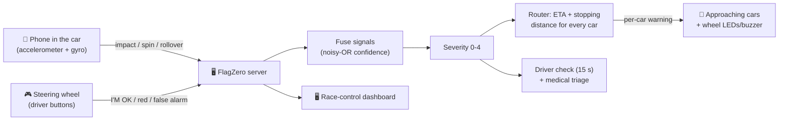

# FlagZero 🏁

**An AI safety network for motorsport that warns the drivers who haven't reached a crash yet.**

> *"The driver most at risk isn't the one who crashed; it's the one who hasn't arrived yet."*

FlagZero turns phones into connected car sensors. When a car crashes, one server detects the
incident, fuses every signal about it, decides how serious it is, works out **which cars are
coming and how many seconds away they are**, and warns each of them on their own screen (and on a
physical steering wheel) **before they arrive**. Today that job depends on marshals seeing the
crash and waving a flag.

Built in one night at the Formula Tech Hackathon (Sept 2026), targeting **Track 1: Safety
Diagnosis**, **Ollon** (data-driven safety), **TELUS** (connected solution) and **Ampere** (AI for
motorsport safety).

---

## Contents
1. [The problem](#1-the-problem)
2. [What FlagZero does](#2-what-flagzero-does)
3. [The demo](#3-the-demo)
4. [The steering wheel](#4-the-steering-wheel)
5. [How it decides: flags, severity and ETA](#5-how-it-decides-flags-severity-and-eta)
6. [The proof: Monte Carlo and per-incident replay](#6-the-proof-monte-carlo-and-per-incident-replay)
7. [Quick start](#7-quick-start)
8. [Repository layout](#8-repository-layout)
9. [Tests](#9-tests)
10. [Honest limits](#10-honest-limits)
11. [Paused: the overhead camera (OpenCV)](#11-paused-the-overhead-camera-opencv)
12. [Team](#12-team)

---

## 1. The problem

When a car stops on track, the car that crashed is no longer the one in the most danger. The
danger is the **next car**, arriving at 200+ km/h around a blind corner, whose driver doesn't yet
know anything is wrong. That's a **secondary impact**.

Today the warning chain is human: a marshal has to see the incident, react, and wave a flag, and
the approaching driver has to see that flag. Every step costs time. At the Japanese Grand Prix in
2014, Jules Bianchi left the track at the same corner where Adrian Sutil had crashed a lap earlier,
and hit the recovery vehicle working there under double yellow flags. The FIA introduced the
Virtual Safety Car the following season.

FlagZero asks: **what if every approaching car were warned automatically, within half a second,
with a warning sized to how far away it is?**

---

## 2. What FlagZero does



| Step | What happens |
|---|---|
| **Detect** | The phone in each car classifies motion into KERB, SPIN, IMPACT, SEVERE or ROLLOVER from peak g, rotation rate, rotation angle and a flip test. It also reports when the car is lying still afterwards. |
| **Fuse** | Every signal about one place and moment (within 50 m and 5 s) joins one incident. Confidence is combined with a noisy-OR, so independent sources reinforce each other. |
| **Severity** | Rules turn the fused sources into severity 0-4 (see [section 5](#5-how-it-decides-flags-severity-and-eta)). |
| **Route** | For **every car** within 2 km upstream, the server computes its ETA to the incident and the distance it needs to slow down. That decides the warning level each car gets: a car 4 s away and a car 35 s away get different warnings. |
| **Warn** | Each phone gets its own warning (flag, corner, distance, ETA) with beeps and vibration. It acknowledges receipt, which is how latency is measured end to end. |
| **Driver check** | The crashed car's phone (and steering wheel) runs a **15 s "I'M OK" countdown**. No answer → **automatic RED flag** and medical status URGENT. |
| **Race control** | A live dashboard shows the incident, its sources and confidence, the approaching cars by ETA, the driver's (simulated) vitals, the Interlagos map, a live g trace, latency, and the proof panel. |

**Rules the team chose** (all implemented):
- **Only race control can return a flag to green** (dashboard Reset / Scene). Drivers can escalate or inform, never clear.
- "REPORT FALSE ALARM" is only a report shown to race control; the flags stay out.
- "RECOMMEND RED FLAG" from a driver waits for race control's **Confirm red**. A missed countdown sends RED automatically.
- If the driver presses I'M OK, the crashed car **rejoins and drives on under the current flags**. On a timeout, a red flag or a red request, it stays stopped.
- A crash happens wherever the car is. No corner is special, and incidents are labelled with the nearest named corner of Interlagos.

---

## 3. The demo

| Device | Role |
|---|---|
| iPhone | **Car #17**, the crash car. Its motion sensors are the crash detector (we drop it on a cushion). |
| OnePlus 15R | **Car #21**, the approaching car. Placed ~9 s behind car 17 and gets the warnings. |
| Arduino steering wheel + a phone | Car 17's driver controls: physical buttons, flag LEDs, buzzer ([section 4](#4-the-steering-wheel)) |
| Laptops | Server + race-control dashboard |

The other **18 cars are simulated** on the real **Interlagos** layout (4,247 m, exported from the
FastF1 2023 pole lap, turns T1-T15 with their names). The two phone cars drive in the same
simulation.

**Demo flow**
1. Race control clicks **Scene 2**. Everything resets and car 21 is lined up ~9 s behind car 17, wherever car 17 is.
2. **Drop the iPhone** on a cushion. Car 17 stops where it is and an incident appears on the dashboard, labelled with the nearest corner.
3. Car 21's phone switches to YELLOW, then DOUBLE YELLOW as it closes in, with corner, distance and ETA. Its speed is capped (120 km/h under double yellow) as it passes.
4. Car 17's phone and the steering wheel count down 15 s.
   - **I'M OK** on the wheel → car 17 rejoins under yellow, medical status MONITOR.
   - No answer → **automatic RED**, medical status URGENT.
5. The proof panel replays **this exact incident** with marshals only vs FlagZero, then race control clicks **Reset**.

---

## 4. The steering wheel

A cardboard F1-style wheel with real buttons. The phone taped in the middle is the display; the
buttons do exactly what the phone's own buttons do.

| Button | Arduino pin | Works when |
|---|---|---|
| I'M OK | D2 | during the countdown |
| CONTINUE UNDER YELLOW | D3 | after I'M OK / after reporting a false alarm |
| RECOMMEND RED FLAG | D4 | during the countdown, or after I'M OK (not under red) |
| REPORT FALSE ALARM | D5 | after I'M OK (not under red) |

Yellow LED (A2) and red LED (A3), each through 220 Ω, plus an active buzzer (A1): off = clear,
yellow = caution/yellow, flashing yellow = double yellow/slow zone, red = red flag, red and yellow
alternating with a beep every second = the I'M OK countdown. No soldering needed; everything
plugs into a breadboard. Full wiring and setup: [`hardware/wheel/README.md`](hardware/wheel/README.md).

**How it connects:** `tools/wheel.py` runs on the laptop the Arduino is plugged into. A button
press becomes a `wheel_button` message on the server, which passes it to **every screen of that
car** (the crash-sensor phone and the wheel display, `/car?car=17&wheel=1`). Each screen acts as if
the button had been tapped. When one screen answers the countdown, the others close theirs.

---

## 5. How it decides: flags, severity and ETA

**Warning levels (what a car sees)**

| Level | Flag | Speed cap in the sim |
|---|---|---|
| 0 | Track clear | – |
| 1 | Caution | – |
| 2 | Yellow | – |
| 3 | Double yellow | 120 km/h (500 m flag zone) |
| 4 | Slow zone | 80 km/h |
| 5 | Red flag | 60 km/h |

**Severity (race control)**

| Severity | When | Most any car is shown |
|---|---|---|
| 1 | a kerb strike, or any single source with confidence < 0.6 | Caution |
| 2 | spin, mild impact, debris, a stopped car | Yellow |
| 3 | strong impact (≥ 8 g), rollover, or an impact followed by the car lying still | Double yellow |
| 4 | no answer to the 15 s check, or the driver recommends red | Red flag recommended (auto-RED on timeout) |

**Router (per car, every 50 ms)**

```
ETA        = distance to incident / speed
d_need     = speed × 1.0 s  +  max(0, speed² − (80 km/h)²) / (2 × 1.2 g)
margin     = distance − d_need

ETA < 6 s  or  margin < 100 m  or  within 500 m   →  the incident's full level
6-20 s                                             →  Yellow
20-40 s                                            →  Caution
> 40 s                                             →  nothing
```

Every number here lives in [`flagzero/config.py`](flagzero/config.py).

---

## 6. The proof: Monte Carlo and per-incident replay

We can't crash real race cars, so we measured the *warning chain* in simulation.
[`flagzero/sim/montecarlo.py`](flagzero/sim/montecarlo.py) replays 10,000 random incidents. The
next car arrives 1-10 s behind at 150-250 km/h, with a 50-250 m sightline and 1.0-1.5 g braking.
Each incident is played twice: with **marshals only** (a post sees it 50% of the time, then 0.8-2.5 s
to react and 0.5-1.5 s to flag), and with **FlagZero** (0.3 s phone detection, 0.05-0.3 s network).

Saved run (`results/montecarlo.json`, 10,000 incidents, seed 42):

| | Marshals only | FlagZero |
|---|---|---|
| Approaching car warned before reaching the hazard | 48.4 % | **98.5 %** |
| Secondary impacts | 54.9 % | **26.2 %** (−52 %) |
| Median time from incident to warning | 4.6 s | **0.49 s** |
| Average speed on reaching the hazard | 92 km/h | **43 km/h** |
| False yellows per hour (whole field) | 0 | 1.35 *(placeholder rate, see limits)* |

The dashboard reruns this live with sliders (marshal visibility, reaction time, speed, sightline,
gap), and a chart by gap band shows where no system can help: a car under ~2 s behind can't stop
in time, whoever warns it.

**Per-incident replay.** For every live incident, the server freezes which cars were really
approaching, how far away and how fast, the moment it was detected. It then replays exactly those
cars marshals-only vs FlagZero, using the **measured** detect-to-acknowledged time from the real
phones (`/api/montecarlo/incident`).

**Latency.** Every warning carries an id, and the phone acknowledges it. The dashboard shows live
detect → sent → acknowledged times and the tunnel's round trip (`/api/latency`).

---

## 7. Quick start

**Install once**
```bash
py -m pip install -r requirements.txt          # Mac: python3 -m pip install -r requirements.txt
winget install --id Cloudflare.cloudflared     # Mac: brew install cloudflared
```

**Run**: double-click **`start_demo.bat`** (Mac: **`start_demo.command`**). It starts the server
and an https tunnel, **waits until the tunnel is live**, then opens the dashboard and a QR join
page. Phones need https for motion sensors; the tunnel provides it.

**Connect**
| Who | Opens | Then |
|---|---|---|
| iPhone (car 17) | `https://<tunnel>/car?car=17` (scan the QR) | START → Allow motion |
| OnePlus (car 21) | `https://<tunnel>/car?car=21` | START |
| Wheel's phone | `https://<tunnel>/car?car=17&wheel=1` | START (for sound) |
| Steering wheel | `py -m flagzero.tools.wheel` on its laptop (close the Arduino IDE first) | – |
| Race control | `http://localhost:8000/dashboard` | Scene 2 → drop the phone → Reset |

**No hardware at all**
```bash
py -m flagzero.tools.mock_car --car 17        # keyboard phone: i impact, o ok, x timeout, d red request, f false alarm
py -m flagzero.tools.wheel --no-arduino       # keyboard wheel: o ok, c continue, r red, f false alarm, t test crash
py -m flagzero.tools.scene_check 2            # plays a whole scene against the running server
py -m flagzero.sim.montecarlo --n 10000       # the Monte Carlo on its own
```
Or open `/dashboard?mock=1` for the dashboard running on mock data.

**Troubleshooting**
- `DNS_PROBE_FINISHED_NXDOMAIN`: the tunnel name was opened before it went live (10-40 s). Wait a minute or clear the browser's DNS cache. The launcher waits for you.
- Port 8000 busy: an old server is still running. `netstat -ano | findstr :8000`, then `taskkill /PID <n> /F`.
- Wheel says it can't open the port: close the Arduino IDE (its Serial Monitor holds the port), or pass `--port COM5`.

---

## 8. Repository layout

```
start_demo.bat / .command   one-click launcher -> flagzero/tools/start_demo.py
flagzero/
  server.py                 FastAPI: pages, APIs, websockets /ws/car /ws/dash /ws/vision
  config.py                 every tunable number
  core/                     engine, incidents (association), fusion (noisy-OR), severity,
                            router (ETA/flags), medical, latency, state, track
  sim/                      sim.py (20-car race), marshal.py, montecarlo.py
  web/                      car.html/js (phone + wheel display), dashboard.html/js, join.html (QR)
  tools/                    start_demo, wheel, mock_car, scene_check, export_track, ...
  track.json                real Interlagos from FastF1
  docs/                     protocol.md, state_message.md, phone_changes.md (every change vs the plan)
  vision/                   overhead camera pipeline (paused, see section 11)
hardware/wheel/             Arduino sketch + wiring for the steering wheel
tests/                      pytest suite
results/montecarlo.json     saved 10,000-run Monte Carlo (the dashboard's fallback)
```

The message formats are documented in [`flagzero/docs/protocol.md`](flagzero/docs/protocol.md)
and [`flagzero/docs/state_message.md`](flagzero/docs/state_message.md).

---

## 9. Tests

```bash
py -m pytest -q        # 90 tests (+1 slow one: set FZ_SLOW=1)
```
They drive the same engine the server uses, with no phones needed. Covered: the simulation,
router/ETA, severity, the countdown and auto-red, driver requests, association, latency, the Monte
Carlo, and the steering wheel (its flag/countdown logic, and the server passing a wheel button to
both screens). The run rewrites `results/montecarlo.json`, so restore it afterwards with
`git checkout -- results/`.

---

## 10. Honest limits

FlagZero is a hackathon prototype. It shows an idea and measures it in simulation; it is **not** a
certified safety system. What that means in practice:

**The race is simulated**
- Only two cars are real phones. The other 18 are a simple simulation: a speed profile from corner curvature, fixed acceleration and braking, ±3 % pace variation, and no overtaking or racecraft.
- Even the phone cars' **positions** come from the simulation, not GPS: the phone only supplies crash detection and driver input. A real system would need positioning (GPS/RTK or the circuit's timing loops).

**A phone is not a race car**
- The crash thresholds (3 g impact, 6 g severe) were chosen for **dropping a phone on a cushion**, which usually gives < 8 g. Real crashes are tens of g, with far more vibration and kerb noise, so the classifier is **not validated on real vehicles**.
- We haven't yet measured real detection and false-alarm rates with a proper set of drop tests.
- Browsers limit the sensors: iOS needs https, a tap to allow motion, and the page open with the screen on. Sample rates vary by phone.

**The Monte Carlo is a model, not data**
- The parameter ranges (gaps, speeds, sightlines, braking, marshal reaction and visibility) are plausible assumptions, **not fitted to real incident data**.
- The **false-yellow rate is a placeholder** until drop tests measure it.
- "Secondary impact" means the next car couldn't slow to a safe speed before the hazard, using a simple stopping-distance model. The marshal baseline is simplified too (one post, a fixed chance of seeing the incident).
- The saved run assumes an overhead camera covering **80 %** of incidents. The camera is paused ([section 11](#11-paused-the-overhead-camera-opencv)), so the live demo runs on phones alone.
- The −52 % figure compares the two models under the same assumptions. It is **not** a prediction for a real circuit.

**Connectivity**
- Everything goes through a free cloudflared tunnel and the venue's internet. Latency is measured over that path, not over a race-grade radio network.
- If the server or the link goes down, phones show NO LINK and fall back to a local countdown, but nobody gets new warnings. The single server is a single point of failure.
- **No authentication:** anyone with the tunnel link can open the dashboard and press Reset or Scene. Fine for a demo, not for a real event.

**Medical and driver**
- The driver's heart rate and SpO2 on the dashboard are **simulated**, not measured.
- The 15 s countdown can't tell "unconscious" from "didn't notice the screen". In a real car it would need to live on the wheel (we started that) and in the driver's radio.

**Steering wheel**
- It's tethered to a laptop by USB, and the 16x2 LCD didn't work reliably on our breadboard, so a phone is the display.
- We had four buttons, so there's no physical test-crash button (use `t` in `tools/wheel.py` instead).

**Scope**
- One circuit, one camera zone (paused), and one server. There's no data from real race control, no integration with real marshal systems, and no handling of pit lane, weather or track-limits events.

---

## 11. Paused: the overhead camera (OpenCV)

The repo includes a computer-vision pipeline by Person B (`flagzero/vision/`). An overhead camera
watches a paper section of track (1,380-1,480 m of the lap), tracks ArUco-marker or coloured
"cars", and raises predictive hazards (SPIN_RISK, CLOSING, OFF_TRACK, SLOWING) and debris alerts.
The server already fuses these as extra sources (`/ws/vision`), and the tests for it pass.

It has only been tested on a **synthetic video**, and it's **not part of the current demo** while
we fix problems with the real camera. The rest of FlagZero doesn't depend on it. If it works in
time, it gets added back with `start_demo --vision N`. The steps are in
[`flagzero/vision/`](flagzero/vision/) and the camera tools are `camera_test` and `calibrate`.

---

## 12. Team

| | Built |
|---|---|
| **Ananya (A)** | Server, core engine (incidents, fusion, severity, router, medical, latency), race simulation, Monte Carlo |
| **Anshika (B)** | Computer-vision pipeline (paused) |
| **Vyom (C)** | Phone car node, race-control dashboard, steering wheel, launcher and tools, integration |

Track data: [FastF1](https://github.com/theOehrly/Fast-F1) (2023 São Paulo GP pole lap).
Made overnight with a lot of coffee and help from Claude.
